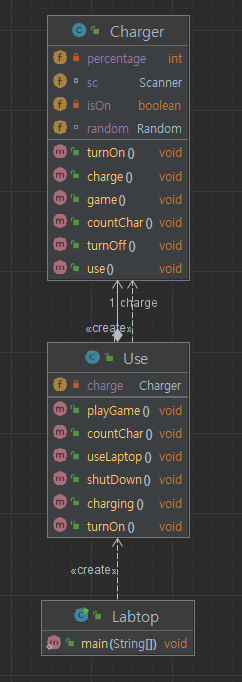

# 프로젝트 소개
-고장난 충전기

# 시스템 요구 사항
1. 노트북은 전원을 켤 수 있다
2. 노트북은 충전을 할 수 있다
3. 5퍼센트 이상 충전된 노트북은 사용을 할 수 있다
4. 노트북의 전원이 켜져 있지 않으면 아래의 기능들을 사용할 수 없다
4. 충전이 된 노트북은 게임을 할 수 있으며 10~20사이의 난수를 생성하여 배터리를 소모한다
5. 노트북은 문자열을 입력 하여 글자 수를 세어주는 프로그램이 있으며 사용 당 2퍼센트의 배터리를 소모한다
6. 기본 배터리 잔량은 전원을 결 수 있을 만큼 되어 있다
7. 노트북은 전원을 종료할 수 있다

[다이어그램]

